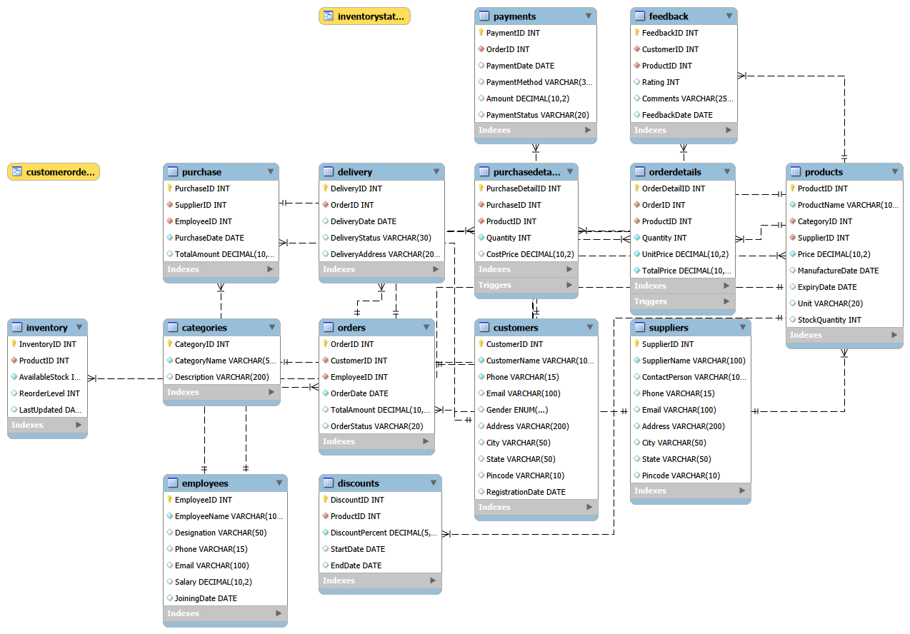

# 🥛 Dairy Products Management System

## 📌 Project Overview

This is a SQL-based Dairy Products Management System developed using MySQL. The project manages customers, products, suppliers, employees, inventory, orders, payments, deliveries, purchases, and feedback.

It demonstrates advanced SQL concepts such as joins, views, stored procedures, functions, triggers, transactions, indexes, and dashboard queries.

---

## 🚀 Features

- Customer Management
- Product Management
- Supplier Management
- Inventory Management
- Order Processing
- Payment Management
- Delivery Tracking
- Purchase Management
- Feedback Management
- Dashboard Reports

---

## 🛠 Technologies Used

- MySQL
- MySQL Workbench
- SQL

---

## 📂 Project Files

- 01_Create_Database.sql
- 02_Create_Tables.sql
- 03_Insert_Data.sql
- 04_Basic_Queries.sql
- 05_Views.sql
- 06_Stored_Procedures.sql
- 07_Functions.sql
- 08_Triggers.sql
- 09_Transactions.sql
- 10_Indexes.sql
- 11_Dashboard_Queries.sql

---

## 📊 SQL Concepts Covered

- DDL
- DML
- Constraints
- Joins
- Aggregate Functions
- GROUP BY
- HAVING
- Views
- Stored Procedures
- Functions
- Triggers
- Transactions
- Indexes

---
## 🗺️ Entity Relationship Diagram

## 👨‍💻 Author

**Romit Joshi**
